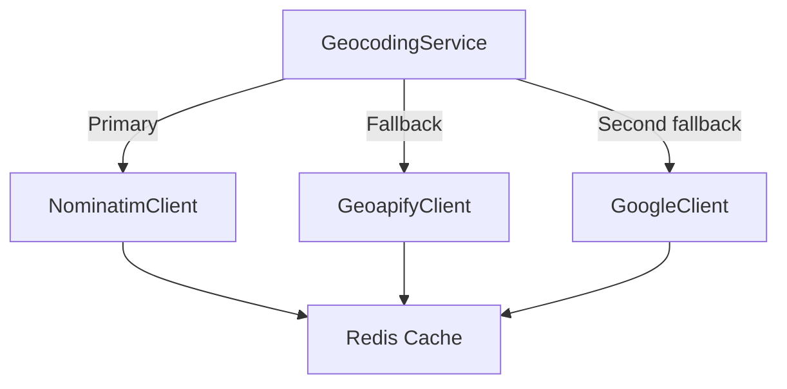

# Horoscopus — План интеграций

## 1. Эфемериды

| Задача | Выбор | Детали |
| --- | --- | --- |
| Основной провайдер | Swiss Ephemeris (`swisseph`) | Максимальная точность, поддержка ретроградности, фиктивных точек и узлов |
| Вспомогательные библиотеки | `astropy`, `pyswisseph` | Верификация расчётов, преобразования систем координат |
| Формат данных | JSON | Нормализованные ключи: `degree`, `sign`, `house`, `speed`, `retrograde` |
| Хранение эфемерид | Локальный кэш | Ежедневное обновление, хранение в S3/PostgreSQL |

### Техтребования
- Установка `swisseph` через wheel (для Windows потребуется `swisseph‑2.x‑cp311‑win_amd64.whl`).
- Распаковка файла эфемерид `sepl_18.se1` в директорию `backend/data/ephemeris`.
- Настройка пути `swe.set_ephe_path(settings.EPHEMERIS_PATH)`.
- Обработка исключений `swe.error` с повторным запросом.

### Расчётные функции
```python
from dataclasses import dataclass
import swisseph as swe

@dataclass
class EphemerisPosition:
    body: str
    degree: float
    sign: str
    house: int
    retrograde: bool
    speed: float


def calculate_body_position(julian_day, body):
    lon, lat, dist, speed_lon = swe.calc_ut(julian_day, body)
    return EphemerisPosition(
        body=body,
        degree=lon,
        sign=int(lon // 30),
        house=0,
        retrograde=speed_lon < 0,
        speed=speed_lon,
    )
```

## 2. Геокодирование

| Приоритет | Провайдер | Лимиты | Авторизация |
| --- | --- | --- | --- |
| 1 | Nominatim (OpenStreetMap) | 1 запрос/секунда | Заголовок `User-Agent`, обязательный `email` |
| 2 | Geoapify | 3000 запросов/день | API ключ |
| 3 | Google Geocoding API | 40k запросов/месяц | API ключ, биллинг |

### Архитектура клиента


### Формат ответа
```json
{
  "name": "Москва, Россия",
  "city": "Москва",
  "state": "Москва",
  "country": "Россия",
  "country_code": "RU",
  "latitude": 55.7558,
  "longitude": 37.6173,
  "timezone": "Europe/Moscow",
  "elevation": 144.0
}
```

### План реализации
1. Создать абстрактный интерфейс `BaseGeocodingClient`.
2. Реализовать `NominatimClient` с ограничением скорости (async sleep/redis rate limiter).
3. Добавить fallback-цепочку и конфиг через `DJANGO_GEOCODING_PROVIDERS`.
4. Кэшировать результаты по `location_hash` в Redis (TTL 30 дней).

## 3. Авторизация и управление сессиями

| Компонент | Действия |
| --- | --- |
| JWT | Библиотека `djangorestframework-simplejwt`, кастомные `TokenObtainPairView`, `TokenRefreshView` |
| Refresh-токены | Хранение в Redis с TTL 30 дней (`user_id:token_id`) |
| Blacklist | Redis sorted set `jwt:blacklist:{user_id}` с причиной |
| Анонимные сессии | `SessionAuthentication`, выдача временного `session_token` (TTL 24 часа) |
| OAuth2 | Django allauth или social-auth-app-django (Google, Apple) |

### Политики безопасности
- Соль и Pepper для паролей (встроенные алгоритмы Django 5).
- 2FA (второй этап в roadmap).
- Ограничение `LOGIN_ATTEMPTS_LIMIT = 5/15мин`, блокировка на 30 мин.

## 4. Кэширование

| Сущность | Ключ | TTL | Комментарий |
| --- | --- | --- | --- |
| Натальная карта | `natal:{user_id}:{birth_hash}` | `None` | Инвалидация при изменении профиля |
| Прогноз | `forecast:{chart_id}:{horizon}:{start_date}` | См. ниже | На 1 день/7 дн./30 дн./90 дн./1 год/5/10/30 лет |
| Геокодирование | `geo:{query_hash}` | 30 дней | Приведение запроса к нижнему регистру, trim |
| Эфемериды | `ephem:{body}:{date}` | 7 дней | Обновление реже в связи с неизменностью |
| PDF отчёт | `report:{report_id}` | 90 дней | Сохранение в S3/MinIO + Redis ключ |

### Реализация
```python
from django.core.cache import cache

def get_or_set_natals(key, compute_fn):
    cached = cache.get(key)
    if cached is not None:
        return cached
    value = compute_fn()
    cache.set(key, value, timeout=None)
    return value
```

## 5. API-ключи и секреты
- Использовать `django-environ` + `AWS Parameter Store`/`Doppler`/`Vault`.
- Структура переменных `.env`:
  - `SWISSEPH_PATH=/app/data/ephemeris`
  - `NOMINATIM_USER_AGENT=HoroscopusBot/1.0`
  - `GEOAPIFY_API_KEY=...`
  - `GOOGLE_GEOCODING_KEY=...`
  - `REDIS_URL=redis://...`
- Для локальной разработки — `backend/.env` (в .gitignore).
- Для продакшена — secrets manager + Kubernetes secrets / Heroku config vars.

## 6. Контроль качества интеграций
- Юнит-тесты с фиктивными ответами (`responses`/`pytest-httpx`).
- Smokе-тесты внешних API (раз в день cron job).
- Мониторинг ошибок через Sentry (tag `integration`).
- Rate limiting (Redis bucket) — защищает от DDOS/перехода лимитов.

